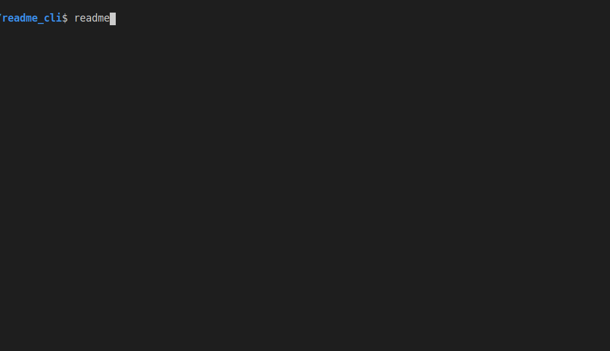

# readme_cli

Readme_cli is a command-line tool that instantly fetches and diplays Readme files of github repositories in the command 
line interface

## Installation

>Requires Python 3.0 or higher.

`$ pip install read-me-cli==0.2.1`

## Usage

Run readme_cli with the url to the github repository:

`$ readme_cli [github repository url]`

This will fetch the readme.md contents of that repository and display them in the CLI.

## Contributing

To make a contribution, fork the repo, make your changes and then submit a pull request. Please try to adhere to the existing style. If you've discovered a bug or have a feature request, create an [issue](https://github.com/Genza999/readme_cli/issues/new)!

## Technologies

Readme_cli is written in Python and built on Urwid. Beautiful Soup is used to scrape Github content.

## Acknowledgements

Special thanks to [awesome-cli-apps](https://github.com/agarrharr/awesome-cli-apps), [awesome-shell](https://github.com/alebcay/awesome-shell), [terminals-are-sexy](https://github.com/k4m4/terminals-are-sexy), and [awesome-mac](https://github.com/jaywcjlove/awesome-mac) for the inspiration!